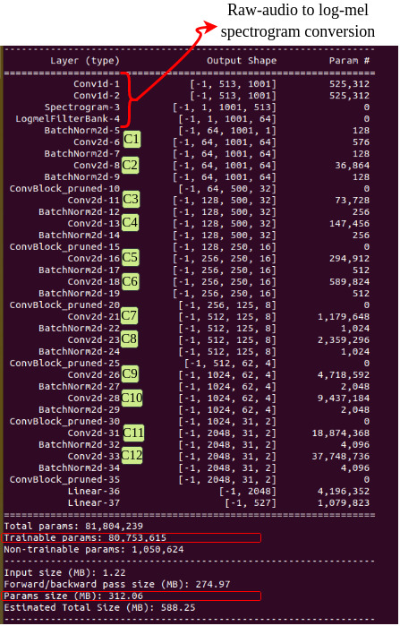

# AI for Sound (AI4S) live sound recognition demo

## Real-time sound recognition demo using Efficient PANNs (E-PANNs).


The E-PANNs [1, 2] {~92MB, 24M parameters} are obtained from the original PANNs (CNN14) {~312MB, 81M parameters)[3].


### A sample video of demo can be viewed at: (https://youtu.be/HiZw0pGXGQk)

### Authors

[1] A Singh, Haohe Liu, and Mark D. Plumbley. "E-PANNs: sound recognition using efficient pre-trained audio neural networks." Inter-Noise and Noise-Con Congress and Conference Proceedings, Institute of Noise Control Engineering, vol 268 No 1, pp 7220-7228, 2023

[2] A Singh and M. D. Plumbley, "Efficient CNNs via Passive Filter Pruning," in IEEE Transactions on Audio, Speech and Language Processing, doi: 10.1109/TASLPRO.2025.3561589.  (https://ieeexplore.ieee.org/document/10966165)

---

[3] Q. Kong, Y. Cao, T. Iqbal, Y. Wang, W. Wang and M. D. Plumbley, "PANNs: Large-Scale Pretrained Audio Neural Networks for Audio Pattern Recognition," in IEEE/ACM Transactions on Audio, Speech, and Language Processing, vol. 28, pp. 2880-2894, 2020, doi: 10.1109/TASLP.2020.3030497.

---

and the current demonstration shown in above Figure is a modification on the top of the AI4S project (https://ai4s.surrey.ac.uk/) previous demo https://github.com/yinkalario/General-Purpose-Sound-Recognition-Demo  built by Yin Cao and Andres Fernandez. 


The prediction/confidence in the above  Figure is obtained by applying the audio tagging system (E-PANNs) on consecutive short audio segments.  


# Installation

### Software dependencies:

We recommend using Anaconda to install the dependencies as follows:

```
conda create -n panns python=3.7
conda activate panns
pip install -r requirements.txt
conda install -c anaconda pyaudio
```

A comprehensive list of working dependencies can be found in the [full_dependencies.txt](assets/full_dependencies.txt) file.

# Model architecture
### PANNs (CNN14)


### E-PANNs model, (Efficient CNN14), model size ~ 92.53MB): 



Download the model into your preferred `<model_location>` from https://doi.org/10.5281/zenodo.7939403
`<model_location>` == `<repo_root>/models`


# RUN

Assuming our command line is on `<repo_root>`, the `panns` environment is active and the model has been downloaded into `<repo_root>/models`, the following command should run the GUI with default parameters (tested on Ubuntu20.04):


```
python demo_tag.py
```

Note that the terminal will print model summary upon start. The syntax to alter them is the same as with `MODEL_PATH`, e.g. to change the number of classes displayed to 10, add `TOP_K=10`.

# Experimental setup/Analysis
## Overall flow diagram to obtain E-PANNs from original PANNs


## Convergence plot of E-PANNs when 25%, 50% and 75% filters are removed from the C7 to C13 layers of PANNS (CNN14).

## Parameters vs mAPs across frameworks for Audio tagging


# Citation

[1] A Singh, Haohe Liu, and Mark D. Plumbley. "E-PANNs: sound recognition using efficient pre-trained audio neural networks." Inter-Noise and Noise-Con Congress and Conference Proceedings, Institute of Noise Control Engineering, vol 268 No 1, pp 7220-7228, 2023

[2] A Singh and M. D. Plumbley, "Efficient CNNs via Passive Filter Pruning," in IEEE Transactions on Audio, Speech and Language Processing, doi: 10.1109/TASLPRO.2025.3561589.  (https://ieeexplore.ieee.org/document/10966165)


---

# Related links:

* https://research.google.com/audioset/dataset
* https://github.com/qiuqiangkong/audioset_tagging_cnn
* https://github.com/qiuqiangkong/panns_inference
* https://github.com/yinkalario/Sound-Event-Detection-AudioSet

# Acknowldgements
This work was supported by Engineering and Physical Sciences Research Council (EPSRC) Grant EP/T019751/1 “AI for Sound (AI4S)”. Project link:  https://ai4s.surrey.ac.uk/
