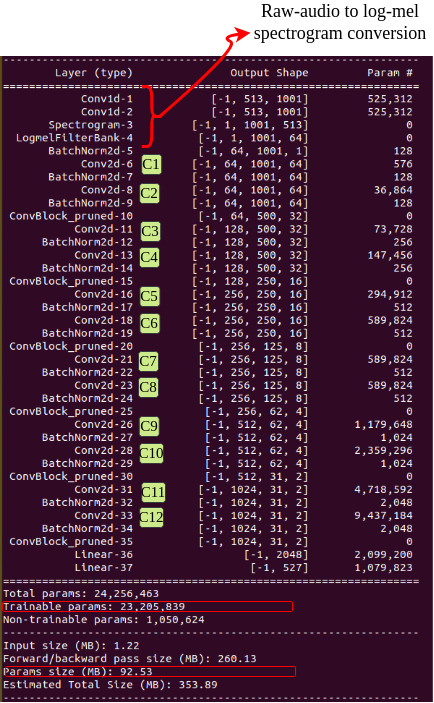

# AI for Sound (AI4S) — Live Sound Recognition Demo

## 🎙️ Real-time Sound Recognition using Efficient PANNs (E-PANNs)


This repository provides a **real-time sound recognition demo** built on **Efficient PANNs (E-PANNs)** [1, 2], efficient versions of the original PANNs (CNN14) [3].  

- **Original PANNs (CNN14):** ~312 MB, 81M parameters  
- **E-PANNs:** ~92 MB, 24M parameters  

👉 A demo video is available here: [YouTube](https://youtu.be/HiZw0pGXGQk)

---

## 👩‍💻 Authors
- [1] A. Singh, H. Liu, and M. D. Plumbley, *E-PANNs: Sound recognition using efficient pre-trained audio neural networks*, Inter-Noise 2023.  
- [2] A. Singh and M. D. Plumbley, *Efficient CNNs via Passive Filter Pruning*, IEEE/ACM TASLP, 2025. [DOI](https://ieeexplore.ieee.org/document/10966165)  
- [3] Q. Kong et al., *PANNs: Large-Scale Pretrained Audio Neural Networks for Audio Pattern Recognition*, IEEE/ACM TASLP, 2020.  

The current demonstration extends the [AI4S project](https://ai4s.surrey.ac.uk/) and builds upon the [General-Purpose Sound Recognition Demo](https://github.com/yinkalario/General-Purpose-Sound-Recognition-Demo) by Yin Cao and Andres Fernandez.

Predictions are generated by applying the E-PANNs audio tagging model to consecutive short audio segments, producing real-time class probabilities.

---

## ⚙️ Installation

We recommend using **Anaconda** for dependency management:

```bash
conda create -n panns python=3.7
conda activate panns
pip install -r requirements.txt
conda install -c anaconda pyaudio
```

A complete dependency list is available in [assets/full_dependencies.txt](assets/full_dependencies.txt).

---

## 🧠 Model Architectures

### Original PANNs (CNN14)


### Efficient PANNs (E-PANNs) — Efficient CNN14 (~92.5 MB)


➡️ Download pretrained E-PANNs model from [Zenodo](https://doi.org/10.5281/zenodo.7939403) and place it under:  
```
<repo_root>/models
```

---

## ▶️ Run Demo

Assuming:
- You are in `<repo_root>`
- The `panns` environment is active
- The model is downloaded into `<repo_root>/models`

Run the GUI demo:

```bash
python demo_tag.py
```

The terminal will print a model summary on startup.  
You can modify runtime arguments, e.g., to display top-10 predictions:

```bash
TOP_K=10 python demo_tag.py
```

---

## 📊 Experimental Setup and Analysis

### Overall Workflow (Pruning PANNs → E-PANNs)


### Convergence with Different Pruning Ratios
(25%, 50%, 75% filters removed in layers C7–C13 of CNN14)  


### Parameters vs. mAP Across Frameworks


---

## 📖 Citation

If you use this work, please cite:

```bibtex
@inproceedings{singh2023epanns,
  title={E-PANNs: Sound recognition using efficient pre-trained audio neural networks},
  author={Singh, Arshdeep and Liu, Haohe and Plumbley, Mark D.},
  booktitle={Inter-Noise and Noise-Con Congress and Conference Proceedings},
  volume={268},
  number={1},
  pages={7220--7228},
  year={2023},
  organization={Institute of Noise Control Engineering}
}

@ARTICLE{10966165,
  author={Singh, Arshdeep and Plumbley, Mark D.},
  journal={IEEE/ACM Transactions on Audio, Speech and Language Processing}, 
  title={Efficient CNNs via Passive Filter Pruning}, 
  year={2025},
  volume={33},
  pages={1763-1774},
  doi={10.1109/TASLPRO.2025.3561589}
}
```

---

## 🔗 Related Links
- [AudioSet Dataset](https://research.google.com/audioset/dataset)  
- [AudioSet Tagging CNN](https://github.com/qiuqiangkong/audioset_tagging_cnn)  
- [PANNs Inference](https://github.com/qiuqiangkong/panns_inference)  
- [Sound Event Detection with AudioSet](https://github.com/yinkalario/Sound-Event-Detection-AudioSet)  

---

## 🙏 Acknowledgements
This work was supported by the **Engineering and Physical Sciences Research Council (EPSRC)**, Grant **EP/T019751/1 — AI for Sound (AI4S)**.  
Project link: [https://ai4s.surrey.ac.uk/](https://ai4s.surrey.ac.uk/)  
